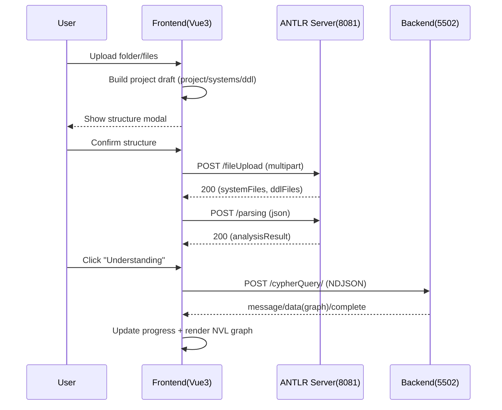
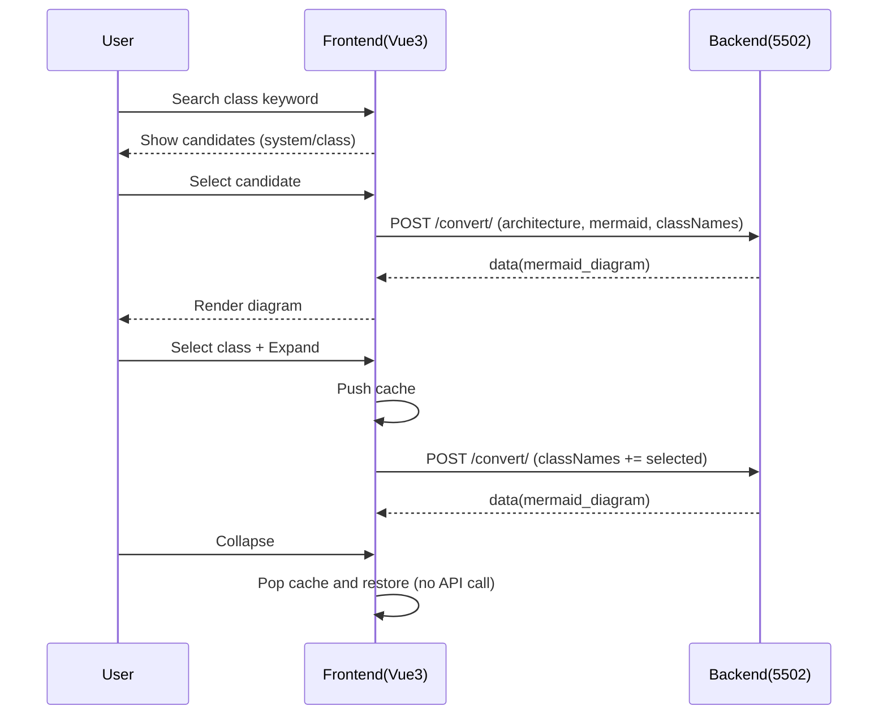

# Legacy Modernizer Frontend PRD (LLM-Implementation Spec)
버전: 1.1 (2025-12-15)  
대상: **Vue 3 + TypeScript + NVL** 기반 프론트엔드 구현을 LLM에게 정확히 위임하기 위한 “구현 가능한 수준의 PRD”  
범위: **파일 업로드 → ANTLR 파싱 → Understanding(그래프) → Convert(전환) 스트리밍 UI**

---

## 0. 이 문서의 사용 방법 (LLM 지시)
이 문서는 “요구사항 문서”이지만, LLM이 실제로 코드를 작성할 수 있도록 다음을 포함합니다.

- **정확한 데이터/상태 모델**(TypeScript 인터페이스 수준)
- **UI/컴포넌트 책임 분리**(props/events/store boundary)
- **스트리밍(NDJSON) 파서 알고리즘**(부분 청크/끊김 케이스 포함)
- **NVL 그래프 렌더링 규약**(대규모 노드 성능, 업데이트 전략)
- **UML(mermaid) 검색-선택-확장/축소 규약**(캐싱 포함)
- **API 호출 계약**(요청/응답/에러/헤더/필드 의미)

> ✅ 구현 시, 이 문서에 “명시적으로” 적힌 내용이 우선이다.  
> ⚠️ 첨부 스펙 문서 일부가 `...` 형태로 축약되어 있는 부분은, 본 문서에서 **명시적 계약(Contract)** 로 재정의한다. 서버와 실제 스펙이 다를 경우, **프론트는 서버 스펙을 우선**하며 본 문서의 계약을 업데이트한다.

---

## 1. 용어 정의 (Glossary)
- **Session**: 프론트에서 생성하는 “작업 단위” 식별자. 모든 API 요청에 `Session-UUID` 헤더로 포함.
- **Project**: 업로드한 최상위 폴더(또는 사용자가 지정한 이름) 단위의 분석/전환 대상.
- **System**: 프로젝트 내부의 하위 시스템(폴더 단위로 자동 추출, 모달에서 재정의 가능).
- **SP Files**: 시스템 폴더 하위의 코드 파일(Stored Procedure/Java 등). API에서는 `systems[].sp[]`로 전달.
- **DDL Files**: `ddl/` 폴더 하위 파일들. API에서는 `ddl[]` 또는 `ddlFiles`로 표현.
- **ANTLR Server (8081)**: 업로드된 파일 저장 + ANTLR 파싱 수행.
- **Backend Server (5502)**: Understanding(그래프 생성) + Convert(전환) 수행(스트리밍 NDJSON).
- **Strategy**: `dbms | framework | architecture | understanding(=cypherQuery)`
- **Target**: 예시) `oracle | postgresql | java | python | mermaid` (전략에 따라 유효 값이 다름)
- **NDJSON Streaming**: 서버가 `\n` 으로 구분된 JSON 객체를 연속 전송하는 방식.

---

## 2. 제품 목표/비목표
### 2.1 목표 (Goals)
- **G1.** 폴더 업로드만으로 `projectName/systems/ddl`이 자동 구성되고, 사용자가 모달에서 쉽게 수정할 수 있다.
- **G2.** 파싱/Understanding/Convert는 모두 **진행 상황이 스트리밍으로 노출**되고, 사용자는 “지금 무엇을 하는지”를 실시간으로 본다.
- **G3.** 그래프는 **NVL**로 구현하며, 수천 노드 규모에서도 **줌/팬/드래그/선택**이 즉시 반응한다.
- **G4.** UML(Mermaid)은 “전체 생성”이 아니라 **검색-선택 기반의 부분 생성**이며, 확장/축소는 캐시로 즉시 동작한다.
- **G5.** Convert 결과(코드/다이어그램)는 스트리밍으로 도착하는 즉시 파일 탭/뷰어에 반영된다.

### 2.2 비목표 (Non-goals)
- Neo4j에 직접 접속해서 쿼리를 실행하거나 DB를 조작하는 기능
- Convert 결과의 “저장/커밋/빌드/배포”까지 제공하는 완전한 IDE
- 백엔드 변환 로직 자체의 품질 개선(프론트는 표시/탐색/조작 제공)

---

## 3. 전역 요구사항 (Global Requirements)
### 3.1 헤더/식별자
- 모든 요청은 **반드시** `Session-UUID` 헤더를 포함해야 한다.
- 사용자가 OpenAI API Key를 입력했다면(선택) `OpenAI-Api-Key` 헤더로 포함할 수 있다.
- 언어 기본값은 `ko`이며, 서버가 언어별 메시지를 지원한다면 `Accept-Language: ko`를 포함할 수 있다.

### 3.2 상태 저장 원칙
- OpenAI API Key는 기본적으로 **로컬 저장 금지(메모리만)**.
- 프로젝트/그래프/다이어그램/탭 정보는 세션 단위로 유지. “Reset(DELETE /deleteAll/)” 시 전체 초기화.

### 3.3 파일 제한
- 업로드 파일은 서버 제한에 따라 **파일당 3MB** 제한을 둔다(클라이언트에서 선검증).

---

## 4. IA(정보구조) / 화면 구조
### 4.1 Top-level 레이아웃
- **HeaderBar**
  - Session 표시
  - OpenAI API Key 입력(옵션)
  - 언어(옵션)
  - Reset 버튼(DELETE /deleteAll/)
- **Main Tabs**
  1) 업로드(Upload)  
  2) 그래프(Understanding Graph)  
  3) 전환(Convert & Diagram)  

### 4.2 업로드 탭(Upload)
- Dropzone(드래그&드롭/클릭 업로드)
- 업로드 구조 편집 모달(ProjectStructureModal)
- 업로드 결과(서버에 저장된 파일 목록 + 원문 보기)
- 파싱 결과(analysisResult) 파일별 보기

### 4.3 그래프 탭(Graph)
- 좌측: 검색/필터/선택 노드 정보
- 중앙: **NVL Canvas**
- 하단/우측: 스트리밍 진행 상태 + 로그

### 4.4 전환 탭(Convert)
- 상단: Strategy/Target 선택 + 실행 버튼
- 좌측: Mermaid UML(architecture일 때) + 확장/축소 UI
- 우측: Convert 산출물 파일 탭(코드 뷰어)

---

## 5. 파일 업로드/자동 구조 인식 (핵심 규칙)
### 5.1 입력(사용자 업로드)
- 사용자는 폴더(또는 다중 파일)를 드래그/선택할 수 있다.
- 브라우저에서 폴더 업로드는 보통 `webkitdirectory` 기반이며, `File.webkitRelativePath`로 경로가 주어진다.

### 5.2 자동 구조 인식 알고리즘(Contract)
입력: `File[]` (각 파일은 relativePath를 가진다고 가정)  
출력: `ProjectStructureDraft`

규칙:
1) **projectName**
   - `relativePath`의 첫 폴더명을 기본값으로 사용
   - 만약 파일이 여러 루트(첫 폴더명이 여러 개)라면:
     - 기본 projectName은 `"uploaded-project"`로 하고, 모달에서 사용자가 지정하게 한다.
2) **ddl**
   - 경로에 `/ddl/` 또는 `\ddl\` 폴더가 포함되면, 해당 하위 파일은 `ddl[]`로 분류
3) **systems**
   - `ddl` 제외 나머지 파일은 “상위 첫 폴더(루트 아래 1단계 폴더)”를 시스템명으로 사용
   - 시스템명 아래의 파일들은 `systems[].sp[]`로 수집

엣지 케이스:
- 루트 바로 아래 파일(예: `project/a.sql`)이 존재하면:
  - 기본 정책: `systems["root"].sp[]`로 넣고 모달에서 이동하도록 한다.
- 시스템 폴더가 중첩된 구조(예: `project/systemA/src/...`)라도:
  - 시스템은 루트 아래 1단계 폴더(`systemA`)만 사용하고, 나머지는 파일 리스트로 유지한다.

### 5.3 업로드 모달에서 가능한 작업(Contract)
- projectName 수정
- systems 리스트에서:
  - 시스템명 수정
  - 시스템 간 파일 드래그 이동(재분류)
  - 시스템 추가/삭제(삭제 시 해당 파일은 “미분류”로 이동)
- ddl 리스트에서 파일 드래그 이동(ddl↔system 이동도 가능)
- “추가 업로드”: 기존 draft에 파일을 합치고 중복 제거 규칙 적용

중복 제거 규칙:
- 동일한 `relativePath` 파일이 다시 업로드되면:
  - 기본 정책: “최신 업로드 파일로 덮어쓰기”

---

## 6. API 계약 (Frontend ↔ Servers)
> 아래 예시는 “정확한 형식”을 목표로 한다. 실제 서버 응답/필드명이 다르면 프론트는 서버에 맞춘다.

## 6.1 ANTLR Server (http://localhost:8081)
### 6.1.1 POST /fileUpload (multipart/form-data)
**목적:** 파일 업로드 + 서버 저장 + 업로드된 파일 내용/메타 반환  
**Headers**
- `Session-UUID: <uuid>`

**Body (multipart)**
- `metadata`: string(JSON)  
- `files`: File[]

**metadata JSON (Contract)**
```json
{
  "projectName": "my-project",
  "systems": [
    { "name": "user", "sp": ["user/Service.java", "user/Repo.java"] },
    { "name": "admin", "sp": ["admin/AdminService.java"] }
  ],
  "ddl": ["ddl/schema.sql", "ddl/init.sql"]
}
```

**Response 200 (예시 Contract)**
```json
{
  "projectName": "my-project",
  "systemFiles": [
    { "system": "user", "fileName": "Service.java", "content": "..." }
  ],
  "ddlFiles": [
    { "fileName": "schema.sql", "content": "..." }
  ]
}
```

**Error 400**
```json
{ "error": "..." }
```

### 6.1.2 POST /parsing (application/json)
**목적:** 업로드된 파일에 대해 ANTLR 파싱 수행  
**Headers**
- `Session-UUID: <uuid>`

**Request Body (Contract)**
```json
{
  "strategy": "dbms|framework|architecture",
  "target": "oracle|postgresql|java|python|...",
  "projectName": "my-project",
  "systems": [
    { "name": "user", "sp": ["user/Service.java"] }
  ]
}
```

**Response 200 (예시 Contract)**
```json
{
  "files": [
    {
      "system": "user",
      "fileName": "Service.java",
      "analysisResult": { "ast": "...", "symbols": "...", "errors": [] }
    }
  ]
}
```

---

## 6.2 Backend Server (http://localhost:5502)
### 6.2.1 POST /cypherQuery/ (Understanding, NDJSON Streaming)
**목적:** Understanding(분석/그래프 생성) 수행 + 스트리밍으로 진행상황/그래프 제공  
**Headers**
- `Session-UUID: <uuid>`
- `OpenAI-Api-Key: <optional>`
- `Accept-Language: ko` (optional)

**Request Body (Contract)**
```json
{
  "strategy": "understanding",
  "target": "java|dbms|...",
  "projectName": "my-project",
  "systems": [
    { "name": "user", "sp": ["user/Service.java"] }
  ]
}
```

**NDJSON 이벤트 스키마(Contract)**
- line 단위 JSON 객체이며 반드시 `type`이 존재한다.

예시:
```json
{"type":"message","content":"Understanding 시작"}
{"type":"data","graph":{"nodes":[...],"links":[...]},"line_number":120,"analysis_progress":0.35,"current_file":"user/Service.java"}
{"type":"complete","content":"Processing complete."}
```

### 6.2.2 POST /convert/ (Convert, NDJSON Streaming)
**목적:** 전략별 전환 수행 + 결과를 스트리밍  
**Headers**
- `Session-UUID: <uuid>`
- `OpenAI-Api-Key: <optional>`
- `Accept-Language: ko` (optional)

#### A) framework/dbms 전환 (Contract)
```json
{
  "strategy": "framework|dbms",
  "target": "java|python|oracle|postgresql|...",
  "projectName": "my-project",
  "systems": [
    { "name": "user", "sp": ["user/Service.java"] }
  ]
}
```

#### B) architecture/mermaid (부분 UML 생성) (Contract)
```json
{
  "strategy": "architecture",
  "target": "mermaid",
  "projectName": "my-project",
  "classNames": ["user/UserService", "admin/UserService"]
}
```

**NDJSON 이벤트 예시(Contract)**
```json
{"type":"message","content":"전환 시작"}
{"type":"status","step":1,"content":"분석 준비"}
{"type":"data","file_type":"code","file_name":"Service.java","code":"...","language":"java"}
{"type":"data","file_type":"mermaid_diagram","diagram":"```mermaid\nclassDiagram\n...\n```","class_count":5,"relationship_count":3}
{"type":"complete","content":"Processing complete."}
```

### 6.2.3 DELETE /deleteAll/ (세션 데이터 삭제)
**목적:** 서버 측 세션 데이터 삭제 및 프론트 초기화 트리거  
**Headers**
- `Session-UUID: <uuid>`

**Response 200**
```json
{ "message": "deleted" }
```

### 6.2.4 POST /downloadJava/ (ZIP 다운로드, 선택 구현)
- Response: `application/octet-stream` (zip)
- 프론트는 “다운로드” 버튼 제공 가능(비필수)

---

## 7. 스트리밍 NDJSON 처리 (구현 필수 규약)
### 7.1 NDJSON 파서 요구사항
- 서버 응답은 chunk 단위로 끊겨 올 수 있으며, JSON 객체는 chunk 경계에서 분리될 수 있다.
- 따라서 반드시 **버퍼 누적 후 `\n` 기준으로 line 분리**해야 한다.
- `\r\n` 가능성도 고려(트림 처리).

### 7.2 파서 의사코드(Contract)
```ts
let buffer = "";
while (true) {
  const { value, done } = await reader.read();
  if (done) break;
  buffer += decoder.decode(value, { stream: true });

  const lines = buffer.split("\n");
  buffer = lines.pop() ?? ""; // 마지막은 불완전 라인일 수 있음

  for (const line of lines) {
    const trimmed = line.trim();
    if (!trimmed) continue;
    const evt = JSON.parse(trimmed);
    dispatchEvent(evt);
  }
}
// 마지막 buffer 처리(끝에 \n 없이 끝난 경우)
if (buffer.trim()) dispatchEvent(JSON.parse(buffer.trim()));
```

### 7.3 이벤트 타입(Contract)
- `message`: { type:"message", content:string, ... }
- `status`: { type:"status", ... }  // step/progress 등 확장 가능
- `data`:   { type:"data", ... }    // graph/code/diagram 등 결과 데이터
- `complete`: { type:"complete", content?:string }
- `error`: { type:"error", content?:string, errorType?:string, traceId?:string }

> 프론트는 **알 수 없는 필드**가 포함되어도 무시하고 진행해야 한다(Forward-compatible).

---

## 8. 그래프(Understanding) 요구사항: NVL 구현 계약
### 8.1 그래프 데이터 계약
서버가 보내는 `data.graph`는 다음 형태를 기본 가정한다:
```ts
type BackendGraph = {
  nodes: Array<{ id: string|number; label?: string; properties?: Record<string, any> }>
  links: Array<{ source: string|number; target: string|number; type?: string }>
}
```

### 8.2 NVL 변환 규칙(Contract)
- 모든 ID는 문자열로 강제한다.
- 노드 캡션(caption) 우선순위:
  1) properties.class_name
  2) properties.name
  3) label
  4) id

TypeScript 모델(권장):
```ts
type NVLNode = { id: string; caption: string; properties?: Record<string, any> }
type NVLRelationship = { id: string; from: string; to: string; caption?: string; properties?: any }
```

관계 id 생성 규칙(충돌 방지):
- 기본: `${from}::${type}::${to}`
- type이 없으면 `${from}::REL::${to}`
- 동일 관계 중복 시 `::#n` suffix를 붙여 유일성 확보

### 8.3 그래프 업데이트 전략(성능 계약)
- 스트리밍에서 `data.graph`가 자주 오면 매 이벤트마다 전체 렌더링을 하면 프레임 드랍이 발생할 수 있다.
- 따라서 아래 중 하나를 반드시 구현한다.
  - (권장) **RAF 기반 배치 적용**: 100~200ms 단위로 마지막 graph만 반영
  - 또는 (대안) “변경분(diff)”만 반영(addAndUpdateElementsInGraph)

### 8.4 그래프 인터랙션(Neo4j Browser 유사 UX)
필수:
- 줌 인/아웃(마우스 휠)
- 팬(배경 드래그)
- 노드 드래그(위치 이동)
- 노드 클릭(선택 + 상세 패널 표시)
- 노드 더블클릭(1단계 확장 UX)

### 8.5 “1단계 확장” 정의(초기 버전 Contract)
> 현재 본 범위에서 “노드 확장 API”가 확정되지 않았으므로, 초기 버전에서 확장은 “탐색 UX”로 정의한다.

- 더블클릭한 노드를 중심으로 1-hop 이웃 노드/관계를 찾아 **강조(highlight)** 한다.
- 강조 상태에서는:
  - 선택 노드 + 이웃 노드만 진하게 표시
  - 나머지는 흐리게(dim) 처리(가시성 확보)
  - 뷰포트를 선택 노드로 포커싱(카메라 이동)
- “축소/해제” 버튼 또는 ESC로 강조 상태를 해제한다.

> 향후 확장 API가 생기면: 서버에서 주변 노드를 받아 addAndUpdateElementsInGraph로 실제 노드 추가.

### 8.6 그래프 검색(Contract)
- 검색 대상: node.caption(또는 properties.class_name)
- 부분 문자열 매칭(대소문자 무시)
- 동일 class_name이 여러 시스템에 존재할 수 있으므로:
  - node.properties.system 또는 node.properties.systemName이 있다면 함께 표시
  - 없다면 “unknown-system”으로 표시하되, UML 생성 후보에서는 제외할 수 있다.

---

## 9. UML(Mermaid) 요구사항: 검색 기반 부분 생성 + 캐싱
### 9.1 UML 생성 입력(Contract)
- classNames는 반드시 `"systemName/className"` 형식
- 동일 클래스명이 여러 시스템에 존재 가능 → 시스템명으로 구분은 필수

### 9.2 “부분 생성” 정의(Contract)
- 서버는 요청된 classNames 기준으로 다이어그램을 생성한다.
- 프론트 UX는 다음 원칙을 강제한다:
  - 기본: “선택 클래스(들) + 1단계 연결 클래스”만 나타나는 결과를 기대
  - 전체 프로젝트 UML 생성 버튼은 제공하지 않는다(성능/가독성 이유)

### 9.3 확장/축소(Contract)
- 확장(Expand):
  1) 사용자가 다이어그램 내 특정 클래스를 선택
  2) 해당 클래스의 `systemName/className`를 classNames에 추가(중복 제거)
  3) API 재호출하여 diagram 업데이트
  4) 호출 전 상태(classNames+diagram)를 캐시 스택에 push
- 축소(Collapse):
  - API 재호출 없이 캐시 스택 pop → 이전 다이어그램 즉시 복원

캐시 키(권장):
- `classNames` 정렬 후 `join("|")`

### 9.4 Mermaid 렌더링(Contract)
- 서버가 `diagram`에 ```mermaid 코드블록을 포함할 수 있으므로,
  - 프론트는 코드블록을 감지하고 내부 `classDiagram ...`만 추출하거나,
  - 그대로 markdown 렌더러로 렌더링하되 XSS 안전 처리 필요

---

## 10. Convert(전환) 요구사항: 스트리밍 산출물 탭/에디터
### 10.1 파일 탭 생성 규칙(Contract)
- Convert 스트림에서 `type=data` 수신 시 아래 조건이면 파일 탭 생성/갱신:
  - `file_type`이 code 계열이고 `file_name`이 존재하면 탭 키는 file_name
  - 동일 file_name 재수신 시: 기본 정책은 “마지막 내용으로 덮어쓰기”

### 10.2 언어/하이라이팅 매핑(권장)
- *.java → java
- *.sql → sql
- pom.xml → xml
- *.xml → xml
- application.properties → properties/ini
- *.py → python

### 10.3 framework step UI(Contract)
- `type=status`에 `step: 1~5`가 오면 체크리스트형 진행으로 표시
- step 메시지는 `content` 또는 `message` 필드를 사용(서버에 맞춤)

### 10.4 dbms UI(Contract)
- 파일별 message 로그(현재 처리 중 파일/단계)를 표시
- 최종적으로 변환 요약(summary)가 오면 요약 패널에 표시(있다면)

---

## 11. 상태관리/데이터 모델 (Pinia + TypeScript)
### 11.1 핵심 타입(권장)
```ts
export type Strategy = "dbms" | "framework" | "architecture" | "understanding";
export type Target = "oracle" | "postgresql" | "java" | "python" | "mermaid" | string;

export interface ProjectSystem {
  name: string;
  sp: string[]; // relative paths (systemName/filename.ext)
}

export interface ProjectStructure {
  projectName: string;
  systems: ProjectSystem[];
  ddl: string[];
}

export interface UploadResponseSystemFile {
  system: string;
  fileName: string;
  content: string;
}

export interface UploadResponseDDLFile {
  fileName: string;
  content: string;
}

export interface FileUploadResponse {
  projectName: string;
  systemFiles: UploadResponseSystemFile[];
  ddlFiles: UploadResponseDDLFile[];
}

export interface ParsingFileResult {
  system: string;
  fileName: string;
  analysisResult: any;
}

export interface ParsingResponse {
  files: ParsingFileResult[];
}

export interface BackendGraph {
  nodes: Array<{ id: string|number; label?: string; properties?: Record<string, any> }>;
  links: Array<{ source: string|number; target: string|number; type?: string }>;
}

export type StreamEvent =
  | { type: "message"; content: string; [k: string]: any }
  | { type: "status"; [k: string]: any }
  | { type: "data"; [k: string]: any }
  | { type: "complete"; content?: string; [k: string]: any }
  | { type: "error"; content?: string; errorType?: string; traceId?: string; [k: string]: any };
```

### 11.2 Store 구성(권장)
- sessionStore: sessionUuid, openAiApiKey, acceptLanguage
- projectStore: projectStructure, strategy/target 선택
- fileStore: localFiles, uploadedFiles, parsingResults
- streamStore: understandingStreamState, convertStreamState
- graphStore: backendGraph, nvlState, selection, highlightState
- diagramStore: searchKeyword, candidates, classNames, mermaidDiagram, cacheStack
- editorStore: openTabs(파일명), fileContentsMap

---

## 12. 컴포넌트 책임 분리 (LLM 구현 지침)
### 12.1 UploadDropzone.vue
- 입력: none
- 출력 이벤트:
  - `files-selected(File[])`
- 책임:
  - webkitdirectory 지원(가능하면)
  - 파일 사이즈 선검증(>3MB 경고)

### 12.2 ProjectStructureModal.vue
- props:
  - `draft: ProjectStructure`
  - `files: File[]`
- emits:
  - `confirm(ProjectStructure)`
  - `cancel()`
- 책임:
  - systems/ddl 편집 UI(드래그 재배치)
  - projectName 수정
  - 미분류 영역(optional)

### 12.3 GraphCanvasNVL.vue
- props:
  - `graph: BackendGraph`
  - `selectedNodeId?: string`
  - `highlight?: { centerId: string; neighborIds: string[] }`
- emits:
  - `node-click(nodeId)`
  - `node-dblclick(nodeId)`
- 책임:
  - NVL 인스턴스 생성/파기
  - graph 업데이트 최적화(배치)
  - interaction handlers 바인딩

### 12.4 MermaidDiagramPanel.vue
- props:
  - `diagram: string`
- emits:
  - `class-click(systemNameClassName)` (추출 가능할 때)
- 책임:
  - mermaid 렌더링
  - 선택/확장 대상 클래스 인식

### 12.5 CodeEditorTabs.vue
- props:
  - `tabs: { key:string; title:string; language:string; content:string }[]`
  - `activeKey: string`
- emits:
  - `change(activeKey)`
- 책임:
  - 탭/에디터 표시
  - 복사 버튼

---

## 13. 오류 처리(Contract)
### 13.1 HTTP 오류
- `response.ok === false`면:
  - toast로 “실패” 표시
  - body가 `{error}` 형태면 그대로 출력
  - 상태코드도 함께 출력

### 13.2 스트리밍 error 이벤트
- `type=error` 수신 시:
  - convert/understanding 상태를 error로 전환
  - traceId가 있으면 화면에 표시(운영 대응용)

### 13.3 사용자 입력 오류
- projectName 비어있으면 실행 버튼 비활성화
- architecture에서 classNames 비어있으면 UML 생성 버튼 비활성화

---

## 14. 수용 기준(AC) / 테스트 체크리스트
### 14.1 업로드/파싱
- AC-01 폴더 업로드 시 projectName/systems/ddl 초안이 생성되어 모달에 나타난다.
- AC-02 모달에서 시스템명을 바꾸고 파일을 드래그로 이동한 뒤 업로드하면, 서버로 전달되는 metadata에 반영된다.
- AC-03 업로드 성공 시 서버가 저장한 파일 원문이 시스템별로 확인된다.
- AC-04 파싱 성공 시 파일별 analysisResult(JSON)가 확인된다.

### 14.2 Understanding/그래프
- AC-05 Understanding 실행 시 current_file/line_number/analysis_progress가 UI에 실시간 반영된다(있을 때).
- AC-06 그래프는 스트리밍 중에도 줌/팬/드래그/선택이 정상 동작한다.
- AC-07 노드 더블클릭 시 1-hop 강조 상태가 활성화되고, 해제 가능하다.

### 14.3 UML/Convert
- AC-08 그래프 노드 기반 검색에서 systemName/className 후보를 선택해 UML 생성이 가능하다.
- AC-09 UML 확장 시 API 재호출로 다이어그램이 업데이트되고, 축소는 캐시로 즉시 복원된다.
- AC-10 Convert 실행 시 스트리밍으로 들어오는 파일이 탭으로 추가되고 코드가 표시된다.
- AC-11 error 이벤트 발생 시 traceId 포함 에러가 노출된다.

---

## 15. 구현 권장 스택(고정 아님)
- Vue 3 + TypeScript + Vite
- Pinia
- NVL: `@neo4j-nvl/base`, `@neo4j-nvl/interaction-handlers`
- Mermaid: `mermaid`
- Editor: Monaco 또는 CodeMirror

---

## 16. 부록: 시퀀스(mermaid)
### 16.1 업로드 → 파싱 → Understanding


### 16.2 UML 생성/확장/축소


---

## 17. 변경 이력
- v1.1 (2025-12-15): LLM 구현용으로 계약/타입/알고리즘/컴포넌트 책임을 강화한 상세 PRD
